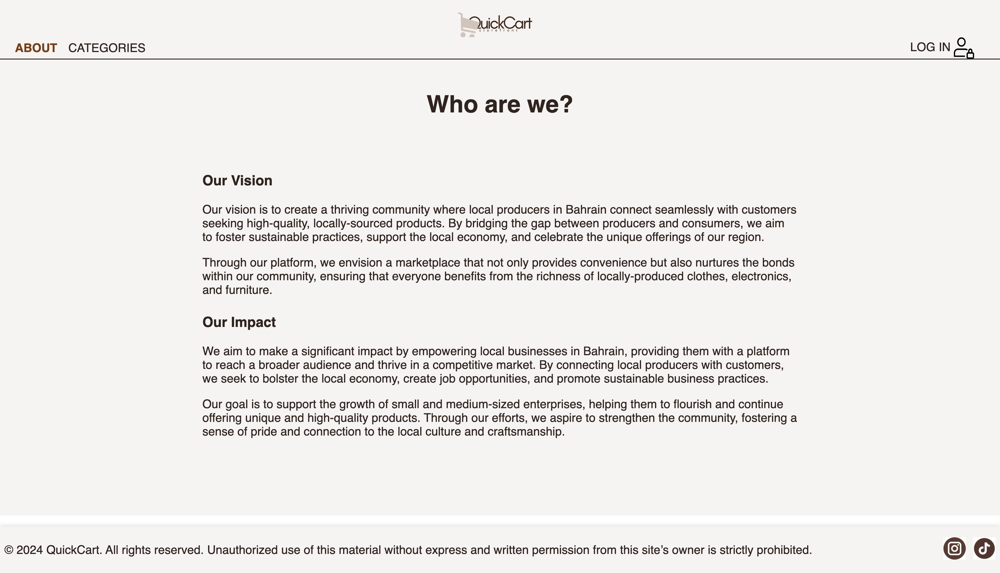
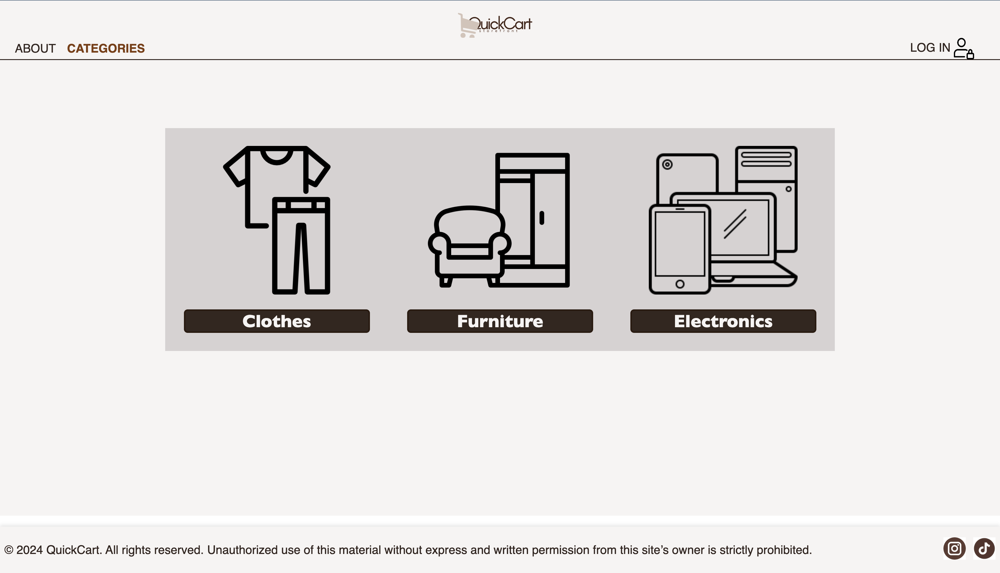

### SEI-Project-2

# QuickCart

## Date: 22/05/2024

### By:

### Yusef Zaman

#### [GitHub](https://github.com/yusefzaman) | [LinkedIn](https://www.linkedin.com/in/yusefzaman/)

### Hawra Alattar

#### [GitHub](https://github.com/hawraalattar) | [LinkedIn](https://www.linkedin.com/in/hawraalattar/)

### Zainab Altalaq

#### [GitHub](https://github.com/zainabaltalaq) | [LinkedIn](https://www.linkedin.com/in/zainabaltalaq/)

---

### **_Description_**

#### The app we propose aims to bring together independent local businesses and buyers who want to support them. The intuitive design will allow the user to view each seller's virtual storefront, where they can then click into each to view the list of items and then into each item to view details on the item and price.

#### If the user is happy with the item, they can add it to their basket and generate an order to purchase the item. The user is also able to leave reviews on the quality and value of the item - for other users to see.

---

### **_Technologies Used_**

- MongoDB
- Express
- node.js
- Mongoose
- Passport
- EJS
- Google OAuth

---

### **_Getting Started_**

##### Sign up and sign in as a new user using a Gmail account and then begin viewing the different sections of the website.

##### A Trello board was used to keep track of development progress and can be viewed [here](https://trello.com/b/89R28lox/unit-2-project).

##### A Canva file where the initial wireframe can be seen [here](https://www.canva.com/design/DAGF-xxIRVg/lBXQV99-FiNTJCVeclvZmg/edit?utm_content=DAGF-xxIRVg&utm_campaign=designshare&utm_medium=link2&utm_source=sharebutton).

##### The project was deployed and can be viewed [here](URL).

---

### **_Screenshots_**

##### About Page

##### Categories Page

---
Live site: [QuickCart](https://sei-project-2-quickcart.onrender.com)

### **_Future Updates_**

- [ ] Adding different levels of buyers depending on how many businesses they have supported - eg bronze, silver, gold, and VIP.
- [ ] Adding a payments terminal to carry out transactions online.

---

### **_Credits_**

### https://www.w3schools.com/js/js_loop_forof.asp

---
